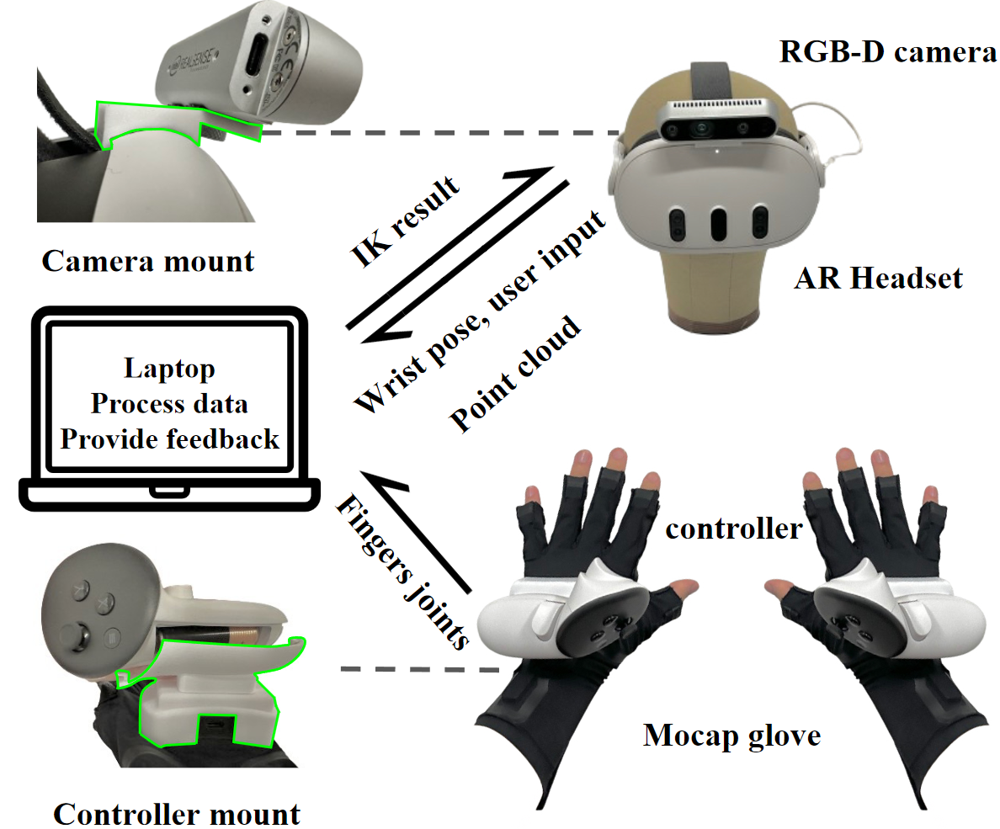

# ARCap: Collecting High-quality Human Demonstrations for Robot Learning with Augmented Reality Feedback
## This is part of official implementation of ARCap: Collecting High-quality Human Demonstrations for Robot Learning with Augmented Reality Feedback
## For training diffusion policy using collected dataset please checkout [link](https://github.com/j96w/DexCap/tree/arcap_policy)
## For more details please check our [website](https://stanford-tml.github.io/ARCap/) and [paper](https://arxiv.org/abs/2410.08464)



## Data collection

### Pre-requisite
1. Operating System: Windows 10/11 (Tested)
2. VR Headset: Meta Quest 3
3. RGB-D Camera: Intel realsense D435 camera [Optional to try our code, required to collect data]

### Install python data collection server
```
cd data_processing
```
#### Install python packages
Python Version: `3.11`
```
pip install -r requirements.txt
```
### Setup local area network
1. Download and Install [Rokoko Studio](https://www.rokoko.com/products/studio/download)
2. Create a scene and connect Rokoko Smart Glove to Rokoko Studio
3. Enable data streaming, set forward IP to your computer's IP, set data format as `JSONv3`
4. Configure `data_processing/ip_config.py` set `VR_HOST` to VR headset IP address and `LOCAL_HOST` to your computer's IP

### Setup hardware
1. 3D print camera mount.[Camera Mount](https://drive.google.com/file/d/1ipEEMy9oShSyLltYa0Zf3lNU6qnpbdig/view?usp=sharing)
2. 3D print glove mount. [Glove Mount](https://drive.google.com/file/d/1fp9NPd11YrgZTHWpGkcWh8cEZzzVP84P/view?usp=sharing)
3. Following instruction of this [video](https://youtu.be/s_ybm4i6EWc?si=aC4Oi5vgOv2SCnR9) to assemble mounts.
4. Connect D435 camera to computer using Type-C cable.

### Install data collection APP on Quest 3
#### Install pre-built binary
1. Install Meta Quest Developer Hub [link](https://developers.meta.com/horizon/documentation/unity/ts-odh-getting-started) in your PC
2. Connect Quest 3 headset to your PC, open Meta Quest Developer Hub, device should be shown in MQDH. If not put on Quest 3, enable developer mode and enable usb debugging.
3. Install `arcap_release.apk` using MQDH -> Device Manager.

#### Build from source
1. Download Unity Hub / Editor [link](https://unity.com/download)
2. Follow [link](https://developers.meta.com/horizon/documentation/unity/unity-before-you-begin/) to install Unity dependencies for quest development
3. In Unity Hub, Add->Add project from disk, select: `ARCap_Unity`
4. Open `ARCap_unity`, waiting for Unity Editor to open
5. Deploy APP on Quest 3:
    - Top menu bar->File->Build Settings, select Android, select Quest 3 as device, Click `Build And Run`

### Start data collection
#### Collect data
In `data_processing` folder, `mkdir data`
1. Leap hand: in `data_processing` folder, run:
```
python data_collection_server.py # --no_camera if D435 is not connected
```
2. Parallel jaw gripper: in `data_processing` folder, run:
```
python data_collection_server.py --handedness left # --no_camera if D435 is not connected
```

All collected data will be stored in `data/<yyyy-mm-dd-hh-mm-ss>`, each trajectory has its own folder named: `data/<yyyy-mm-dd-hh-mm-ss>/<yyyy-mm-dd-hh-mm-ss>`. Each frame is stored as a `.npz`

#### Post-process data to robomimic compatible format
In `data_processing` folder, `mkdir data_processed`
1. Leap hand: in `data_processing` folder, run:
```
python convert_data_with_robot.py --root_path <yyyy-mm-dd-hh-mm-ss> --visualize
```
2. Parallel jaw gripper: in `data_processing` folder, run:
```
python convert_data_with_robot.py --root_path <yyyy-mm-dd-hh-mm-ss> --use_gripper --visualize
```

All processed data will be stored in `data_processed/<yyyy-mm-dd-hh-mm-ss>`, each trajectory has its own folder, named: `data_processed/<yyyy-mm-dd-hh-mm-ss>/demo_i`. Each frame is stored as a subfolder `data_processed/<yyyy-mm-dd-hh-mm-ss>/demo_i/frame_j`, which contains joint angles of hand and arm, wrist poses and point clouds

### Citation
If you find this repository useful please cite:
```
@article{chen2024arcap,
    title={ARCap: Collecting High-quality Human Demonstrations for Robot Learning with Augmented Reality Feedback},
    author={Chen, Sirui and Wang, Chen and Nguyen, Kaden and Fei-Fei, Li and Liu, C Karen},
    journal={arXiv preprint arXiv:2410.08464},
    year={2024}
}
```


